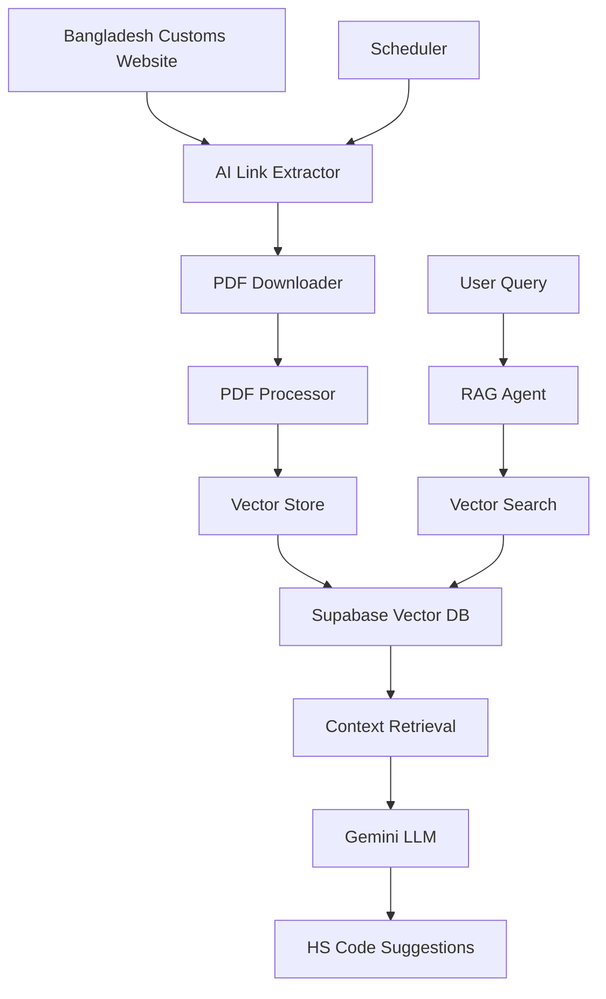

# 🚀 **Comprehensive HS Code Classification System Plan**

## **AI-Powered RAG with LangChain, Supabase & Gemini (2025)**

---

## 📋 **Table of Contents**

1. [System Overview](#system-overview)
2. [Architecture Design](#architecture-design)
3. [AI-Powered Components](#ai-powered-components)
4. [Database Schema](#database-schema)
5. [Implementation Phases](#implementation-phases)
6. [API Design](#api-design)
7. [Timeline &amp; Milestones](#timeline--milestones)

---

## 🎯 **System Overview**

### **Objective**

Build an intelligent HS code classification system that automatically fetches Bangladesh Customs tariff documents, processes them using AI, and provides accurate HS code suggestions through a RAG-powered agent.

### **Key Features**

- 🤖 **AI-Powered PDF Link Extraction**: Automatically identifies and extracts PDF links from the customs website
- 🧠 **Optimized Vector Store**: Fixed database schema optimized for HS code data
- 🔍 **Advanced RAG Agent**: Vector similarity search with context-aware classification
- 📅 **Automated Scheduling**: Daily monitoring with intelligent change detection
- 🎯 **High Accuracy**: Context-aware classification with confidence scoring

### **Technology Stack**

```yaml
Backend:
  - Node.js + TypeScript
  - Express.js
  - LangChain.js v0.2+
  - Google Gemini 1.5 Pro
  - Google Embeddings 1536

Database:
  - Supabase (PostgreSQL)
  - pgvector extension
  - Optimized schema

AI/ML:
  - LangChain RAG patterns
  - Vector similarity search
  - Intelligent document parsing
  - Context-aware classification

Infrastructure:
  - Node.js runtime
  - Cron scheduling
  - Error handling
```

---

## 🏗️ **Architecture Design**



### **Core Components**

1. **AI Link Extractor**: Uses AI to intelligently identify PDF links from the customs website
2. **PDF Processor**: Robust parsing with AI fallback for structure changes
3. **Vector Store**: Optimized schema and data organization
4. **RAG Agent**: Advanced retrieval and generation for HS code classification
5. **Scheduler**: Automated PDF monitoring and processing pipeline
6. **API Gateway**: RESTful endpoints for frontend integration

---

## 🤖 **AI-Powered Components**

### **1. AI PDF Link Extractor**

```typescript
// services/aiLinkExtractor.ts
import { ChatGoogleGenerativeAI } from "@langchain/google-genai";
import { PromptTemplate } from "@langchain/core/prompts";
import axios from "axios";
import * as cheerio from "cheerio";

interface PDFLinkInfo {
  url: string;
  title: string;
  version: string;
  type: "tariff" | "sro" | "finance_bill" | "instructions";
  lastModified?: string;
  confidence: number;
}

class AILinkExtractor {
  private llm = new ChatGoogleGenerativeAI({
    modelName: "gemini-1.5-pro",
    temperature: 0.1,
    apiKey: process.env.GOOGLE_API_KEY!,
  });

  private promptTemplate = PromptTemplate.fromTemplate(`
You are an expert web scraping AI specialized in extracting PDF links from government customs websites.

Website HTML Content:
{htmlContent}

Instructions:
1. Analyze the HTML content to find PDF links related to customs tariffs, SROs, and regulations
2. Focus on the BUDGET section and any navigation menus
3. Extract the most recent/current versions of documents
4. Identify document types: tariff, sro, finance_bill, instructions
5. Extract version information from filenames or links
6. Provide confidence scores for each extraction

Return JSON format:
{{
  "success": true/false,
  "documents": [
    {{
      "url": "full_url",
      "title": "document_title",
      "version": "version_string",
      "type": "document_type",
      "confidence": 0.95,
      "lastModified": "date_if_available"
    }}
  ],
  "error": "error_message_if_failed"
}}

Response:
`);

  async extractPDFLinks(websiteUrl: string): Promise<PDFLinkInfo[]> {
    try {
      // Fetch website content
      const response = await axios.get(websiteUrl, {
        timeout: 30000,
        headers: {
          "User-Agent":
            "Mozilla/5.0 (Windows NT 10.0; Win64; x64) AppleWebKit/537.36",
        },
      });

      const $ = cheerio.load(response.data);

      // Clean HTML for AI processing
      const cleanHTML = this.cleanHTMLForAI($);

      // Use AI to extract PDF links
      const chain = this.promptTemplate.pipe(this.llm);
      const result = await chain.invoke({ htmlContent: cleanHTML });

      // Parse AI response
      const jsonMatch = result.match(/\{[\s\S]*\}/);
      const jsonString = jsonMatch ? jsonMatch[0] : result;
      const aiResponse = JSON.parse(jsonString);

      if (!aiResponse.success) {
        throw new Error(aiResponse.error || "AI extraction failed");
      }

      return aiResponse.documents.map((doc: any) => ({
        url: this.normalizeUrl(doc.url, websiteUrl),
        title: doc.title,
        version: doc.version,
        type: doc.type,
        confidence: doc.confidence,
        lastModified: doc.lastModified,
      }));
    } catch (error) {
      console.error("AI Link extraction error:", error);
      throw error;
    }
  }

  private cleanHTMLForAI($: cheerio.CheerioAPI): string {
    // Remove scripts, styles, and unnecessary elements
    $("script, style, nav, header, footer").remove();

    // Extract relevant sections
    const relevantContent = $("body").html() || "";

    // Truncate if too long (AI context limits)
    return relevantContent.length > 50000
      ? relevantContent.substring(0, 50000) + "..."
      : relevantContent;
  }

  private normalizeUrl(url: string, baseUrl: string): string {
    if (url.startsWith("http")) return url;
    if (url.startsWith("/")) return new URL(url, baseUrl).href;
    return new URL(url, baseUrl).href;
  }
}
```

### **2. Standard PDF Processing**

Since the tariff data is in a structured tabular format, we don't need AI for schema generation. The database schema is fixed and optimized for the specific data structure we're working with.

---

## 📊 **Database Schema**

### **Optimized Schema for Tabular Tariff Data**

```sql
-- Enable required extensions
CREATE EXTENSION IF NOT EXISTS vector;
CREATE EXTENSION IF NOT EXISTS "uuid-ossp";

-- Simple documents table for vector search
CREATE TABLE documents (
  id UUID PRIMARY KEY DEFAULT uuid_generate_v4(),
  content TEXT NOT NULL,
  metadata JSONB,
  embedding VECTOR(1536), -- Google embeddings dimension
  created_at TIMESTAMP DEFAULT NOW()
);

-- Document versions tracking
CREATE TABLE document_versions (
  id UUID PRIMARY KEY DEFAULT uuid_generate_v4(),
  document_type VARCHAR(50) NOT NULL,
  version VARCHAR(20) NOT NULL,
  file_url TEXT NOT NULL,
  file_hash VARCHAR(64) NOT NULL,
  processed_at TIMESTAMP DEFAULT NOW(),
  is_active BOOLEAN DEFAULT true,

  UNIQUE(document_type, version)
);

-- Indexes for performance
CREATE INDEX idx_documents_embedding ON documents
USING ivfflat (embedding vector_cosine_ops) WITH (lists = 100);

-- Simple similarity search function
CREATE OR REPLACE FUNCTION match_documents(
  query_embedding VECTOR(1536),
  match_count INT DEFAULT 5,
  filter JSONB DEFAULT '{}'
)
RETURNS TABLE (
  id UUID,
  content TEXT,
  metadata JSONB,
  similarity FLOAT
)
LANGUAGE plpgsql AS $$
BEGIN
  RETURN QUERY
  SELECT
    d.id,
    d.content,
    d.metadata,
    1 - (d.embedding <=> query_embedding) AS similarity
  FROM documents d
  WHERE d.metadata @> filter
  ORDER BY d.embedding <=> query_embedding
  LIMIT match_count;
END;
$$;
```

---

## 🔄 **Implementation Phases**

### **Phase 1: Foundation Setup (Week 1)**

#### **1.1 Environment Configuration**

```bash
# Project structure
mkdir hs-code-rag-system
cd hs-code-rag-system

# Initialize project
npm init -y
npm install typescript @types/node ts-node nodemon

# Core dependencies
npm install @langchain/core @langchain/google-genai @langchain/community
npm install @supabase/supabase-js
npm install express cors helmet morgan
npm install axios cheerio node-cron
npm install dotenv

# Development dependencies
npm install -D @types/express @types/cors @types/node-cron
npm install -D eslint prettier husky lint-staged
```

#### **1.2 Environment Variables**

```env
# Supabase Configuration
SUPABASE_URL=https://your-project.supabase.co
SUPABASE_SERVICE_ROLE_KEY=your-service-role-key
SUPABASE_ANON_KEY=your-anon-key

# Google AI Configuration
GOOGLE_API_KEY=your-gemini-api-key
GOOGLE_EMBEDDING_MODEL=text-embedding-004

# Application Configuration
NODE_ENV=production
PORT=3000
LOG_LEVEL=info

# Bangladesh Customs
CUSTOMS_BASE_URL=https://customs.gov.bd
CUSTOMS_TARIFF_URL=https://customs.gov.bd/index.jsf

# File Processing
TEMP_DIR=./temp
MAX_FILE_SIZE=50MB
CLEANUP_INTERVAL=24h
```

### **Phase 2: AI Components Development (Week 2)**

#### **2.1 AI Link Extractor Implementation**

```typescript
// src/services/aiLinkExtractor.ts
export class AILinkExtractor {
  // Implementation as shown above
}

// src/services/websiteMonitor.ts
import { createClient } from "@supabase/supabase-js";
import axios from "axios";
import * as fs from "fs";
import * as crypto from "crypto";

export class WebsiteMonitor {
  private supabase = createClient(
    process.env.SUPABASE_URL!,
    process.env.SUPABASE_SERVICE_ROLE_KEY!
  );
  private linkExtractor = new AILinkExtractor();

  async checkForUpdates(): Promise<DocumentInfo[]> {
    const links = await this.linkExtractor.extractPDFLinks(
      process.env.CUSTOMS_TARIFF_URL!
    );

    return this.filterNewDocuments(links);
  }

  private async filterNewDocuments(
    links: PDFLinkInfo[]
  ): Promise<DocumentInfo[]> {
    const newDocuments: DocumentInfo[] = [];

    for (const link of links) {
      // Check if this document version already exists
      const { data: existing } = await this.supabase
        .from("document_versions")
        .select("*")
        .eq("document_type", link.type)
        .eq("version", link.version)
        .single();

      if (!existing) {
        newDocuments.push({
          type: link.type,
          version: link.version,
          url: link.url,
          hash: await this.generateFileHash(link.url),
        });
      }
    }

    return newDocuments;
  }

  async downloadDocument(url: string, filePath: string): Promise<void> {
    const response = await axios({
      method: "GET",
      url: url,
      responseType: "stream",
      timeout: 60000,
    });

    const writer = fs.createWriteStream(filePath);
    response.data.pipe(writer);

    return new Promise((resolve, reject) => {
      writer.on("finish", resolve);
      writer.on("error", reject);
    });
  }

  private async generateFileHash(url: string): Promise<string> {
    const response = await axios.get(url, { responseType: "arraybuffer" });
    return crypto.createHash("sha256").update(response.data).digest("hex");
  }
}
```

### **Phase 3: Document Processing Pipeline (Week 3)**

#### **3.1 PDF Processor for Tabular Data**

```typescript
// src/services/pdfProcessor.ts
import { PDFLoader } from "@langchain/community/document_loaders/fs/pdf";
import { RecursiveCharacterTextSplitter } from "langchain/text_splitter";
import { GoogleGenerativeAIEmbeddings } from "@langchain/google-genai";
import { createClient } from "@supabase/supabase-js";

export class PDFProcessor {
  private supabase = createClient(
    process.env.SUPABASE_URL!,
    process.env.SUPABASE_SERVICE_ROLE_KEY!
  );
  private embeddings = new GoogleGenerativeAIEmbeddings({
    modelName: "text-embedding-004",
    apiKey: process.env.GOOGLE_API_KEY!,
  });

  async processPDF(
    filePath: string,
    documentInfo: DocumentInfo
  ): Promise<void> {
    console.log(
      `📄 Processing PDF: ${documentInfo.type} v${documentInfo.version}`
    );

    try {
      // 1. Load PDF with LangChain
      const loader = new PDFLoader(filePath, {
        splitPages: false,
        parsedItemSeparator: " ",
      });

      const docs = await loader.load();
      const fullText = docs.map((doc) => doc.pageContent).join("\n");

      // 2. Parse tabular tariff data with fallback
      let tariffRows: TariffRow[];
      try {
        tariffRows = this.parseTariffTable(fullText);
        console.log(`📊 Found ${tariffRows.length} tariff entries`);
      } catch (parseError) {
        console.warn(`⚠️ Standard parsing failed: ${parseError.message}`);
        console.log(`🤖 Attempting AI-powered parsing as fallback...`);

        // Fallback to AI parsing if structure has changed
        tariffRows = await this.parseWithAI(fullText);
        console.log(`🤖 AI parsing found ${tariffRows.length} tariff entries`);
      }

      if (tariffRows.length === 0) {
        throw new Error("No valid tariff entries found in PDF");
      }

      // 3. Create chunks for vector search (group by HS code ranges)
      const chunks = this.createChunksFromTariffData(tariffRows);
      console.log(`📦 Created ${chunks.length} chunks for vector storage`);

      // 4. Generate embeddings and store (with transaction safety)
      await this.storeChunks(chunks, documentInfo);

      console.log(
        `✅ Successfully processed PDF: ${documentInfo.type} v${documentInfo.version}`
      );
    } catch (error) {
      console.error(
        `❌ Failed to process PDF: ${documentInfo.type} v${documentInfo.version}`,
        error
      );
      throw new Error(`PDF processing failed: ${error.message}`);
    }
  }

  private parseTariffTable(text: string): TariffRow[] {
    const lines = text.split("\n");
    const tariffRows: TariffRow[] = [];
    let failedRows = 0;
    let totalRows = 0;

    // Find the start of tariff data (after header)
    let startIndex = -1;
    let headerLine = "";
    for (let i = 0; i < lines.length; i++) {
      if (
        lines[i].includes("Hscode") &&
        lines[i].includes("TARRIFF_DESCRIPTION")
      ) {
        startIndex = i + 1;
        headerLine = lines[i];
        break;
      }
    }

    if (startIndex === -1) {
      throw new Error("Could not find tariff table header");
    }

    console.log(`📋 Found header: ${headerLine}`);

    // Parse each tariff row
    for (let i = startIndex; i < lines.length; i++) {
      const line = lines[i].trim();
      if (!line || line.length < 10) continue; // Skip empty lines

      totalRows++;
      const row = this.parseTariffRow(line);
      if (row) {
        tariffRows.push(row);
      } else {
        failedRows++;
        if (failedRows <= 5) {
          // Log first 5 failures for debugging
          console.warn(
            `⚠️ Failed to parse row ${i}: ${line.substring(0, 100)}...`
          );
        }
      }
    }

    // Check if we have too many failures (structure might have changed)
    const failureRate = failedRows / totalRows;
    if (failureRate > 0.3) {
      // More than 30% failure rate
      console.error(
        `❌ High failure rate: ${failedRows}/${totalRows} rows failed (${(
          failureRate * 100
        ).toFixed(1)}%)`
      );
      throw new Error(
        `PDF structure may have changed. High parsing failure rate: ${(
          failureRate * 100
        ).toFixed(1)}%`
      );
    }

    if (failedRows > 0) {
      console.warn(
        `⚠️ ${failedRows}/${totalRows} rows failed to parse (${(
          failureRate * 100
        ).toFixed(1)}% failure rate)`
      );
    }

    console.log(`✅ Successfully parsed ${tariffRows.length} tariff rows`);
    return tariffRows;
  }

  private parseTariffRow(line: string): TariffRow | null {
    try {
      // Parse: "01012100 Pure-bred breeding animals of horses.. 5 0 0 5 0 0.0 10.00"
      const parts = line.split(/\s+/);

      // Validate minimum required parts (HS code + description + at least some rates)
      if (parts.length < 3) {
        console.warn(`⚠️ Insufficient parts in line: ${line}`);
        return null;
      }

      const hsCode = parts[0];
      if (!/^\d{8}$/.test(hsCode)) {
        console.warn(`⚠️ Invalid HS code format: ${hsCode}`);
        return null;
      }

      // Extract description (everything between HS code and first number)
      const descriptionStart = line.indexOf(hsCode) + hsCode.length + 1;
      const firstNumberIndex = line.search(/\s+\d+\s/);

      if (firstNumberIndex === -1) {
        console.warn(`⚠️ No tariff rates found in line: ${line}`);
        return null;
      }

      const description = line
        .substring(descriptionStart, firstNumberIndex)
        .trim();

      // Extract tariff rates - handle variable number of rates
      const rateParts = parts.slice(-7); // Get last 7 parts (expected rates)
      const rates = rateParts.map((rate) => parseFloat(rate) || 0);

      // Validate that we have meaningful tariff data
      const hasValidRates = rates.some((rate) => rate > 0 || rate === 0);
      if (!hasValidRates) {
        console.warn(`⚠️ No valid tariff rates found in line: ${line}`);
        return null;
      }

      return {
        hsCode,
        description,
        cd: rates[0] || 0,
        sd: rates[1] || 0,
        vat: rates[2] || 0,
        ait: rates[3] || 0,
        rd: rates[4] || 0,
        at: rates[5] || 0,
        tti: rates[6] || 0,
      };
    } catch (error) {
      console.error(`❌ Error parsing tariff row: ${line}`, error);
      return null;
    }
  }

  private async parseWithAI(fullText: string): Promise<TariffRow[]> {
    const { ChatGoogleGenerativeAI } = await import("@langchain/google-genai");
    const { PromptTemplate } = await import("@langchain/core/prompts");

    const llm = new ChatGoogleGenerativeAI({
      modelName: "gemini-1.5-pro",
      temperature: 0.1,
      apiKey: process.env.GOOGLE_API_KEY!,
    });

    const promptTemplate = PromptTemplate.fromTemplate(`
You are an expert at parsing Bangladesh Customs tariff data. The PDF structure may have changed.

Extract all tariff entries from this text and return them in JSON format.

Text to parse:
{text}

Return JSON format:
{{
  "success": true,
  "tariffRows": [
    {{
      "hsCode": "string (8 digits)",
      "description": "string",
      "cd": number,
      "sd": number,
      "vat": number,
      "ait": number,
      "rd": number,
      "at": number,
      "tti": number
    }}
  ]
}}

Rules:
1. Extract all valid HS codes (8-digit numbers)
2. Extract descriptions (text between HS code and tariff rates)
3. Extract all tariff rates (CD, SD, VAT, AIT, RD, AT, TTI)
4. If a rate is missing or unclear, use 0
5. Only include rows with valid 8-digit HS codes

Response:
`);

    try {
      const chain = promptTemplate.pipe(llm);
      const result = await chain.invoke({
        text: fullText.substring(0, 50000), // Limit text size
      });

      const jsonMatch = result.match(/\{[\s\S]*\}/);
      const jsonString = jsonMatch ? jsonMatch[0] : result;
      const aiResponse = JSON.parse(jsonString);

      if (!aiResponse.success || !aiResponse.tariffRows) {
        throw new Error("AI parsing failed to extract tariff data");
      }

      // Validate and clean the AI response
      const validRows = aiResponse.tariffRows.filter((row: any) => {
        return (
          row.hsCode &&
          /^\d{8}$/.test(row.hsCode) &&
          row.description &&
          typeof row.cd === "number"
        );
      });

      console.log(`🤖 AI extracted ${validRows.length} valid tariff rows`);
      return validRows;
    } catch (error) {
      console.error("❌ AI parsing failed:", error);
      throw new Error(`AI fallback parsing failed: ${error.message}`);
    }
  }

  private createChunksFromTariffData(tariffRows: TariffRow[]): DocumentChunk[] {
    const chunks: DocumentChunk[] = [];
    const chunkSize = 50; // Group 50 HS codes per chunk

    for (let i = 0; i < tariffRows.length; i += chunkSize) {
      const chunkRows = tariffRows.slice(i, i + chunkSize);
      const content = this.formatChunkContent(chunkRows);

      chunks.push({
        content,
        metadata: {
          startHsCode: chunkRows[0].hsCode,
          endHsCode: chunkRows[chunkRows.length - 1].hsCode,
          rowCount: chunkRows.length,
          documentType: "tariff",
        },
      });
    }

    return chunks;
  }

  private formatChunkContent(rows: TariffRow[]): string {
    return rows
      .map(
        (row) =>
          `HS Code: ${row.hsCode}\nDescription: ${row.description}\nTariff Rates: CD=${row.cd}%, SD=${row.sd}%, VAT=${row.vat}%, AIT=${row.ait}%, RD=${row.rd}%, AT=${row.at}%, TTI=${row.tti}%`
      )
      .join("\n\n");
  }

  private async storeChunks(
    chunks: DocumentChunk[],
    documentInfo: DocumentInfo
  ): Promise<void> {
    console.log(
      `🔄 Starting database transaction for ${chunks.length} chunks...`
    );

    try {
      // Start transaction - store new data first without deleting old data
      const batchSize = 10;
      const allDocuments = [];

      // Process all chunks and prepare documents
      for (let i = 0; i < chunks.length; i += batchSize) {
        const batch = chunks.slice(i, i + batchSize);

        // Generate embeddings for batch
        const contents = batch.map((chunk) => chunk.content);
        const embeddings = await this.embeddings.embedDocuments(contents);

        // Prepare data for insertion
        const documents = batch.map((chunk, index) => ({
          content: chunk.content,
          metadata: {
            ...chunk.metadata,
            version: documentInfo.version,
            documentType: documentInfo.type,
          },
          embedding: embeddings[index],
        }));

        allDocuments.push(...documents);
        console.log(
          `📊 Processed batch ${Math.floor(i / batchSize) + 1}/${Math.ceil(
            chunks.length / batchSize
          )}`
        );
      }

      // Insert all new documents
      console.log(`💾 Inserting ${allDocuments.length} documents...`);
      const { error: insertError } = await this.supabase
        .from("documents")
        .insert(allDocuments);

      if (insertError) {
        console.error("❌ Error inserting new documents:", insertError);
        throw new Error(`Failed to insert documents: ${insertError.message}`);
      }

      // Only after successful insertion, update document version
      console.log(`📝 Updating document version tracking...`);
      const { error: versionError } = await this.supabase
        .from("document_versions")
        .upsert({
          document_type: documentInfo.type,
          version: documentInfo.version,
          file_url: documentInfo.url,
          file_hash: documentInfo.hash,
          processed_at: new Date().toISOString(),
          is_active: true,
        });

      if (versionError) {
        console.error("❌ Error updating document version:", versionError);
        // Rollback: delete the documents we just inserted
        await this.supabase
          .from("documents")
          .delete()
          .eq("metadata->version", documentInfo.version)
          .eq("metadata->documentType", documentInfo.type);
        throw new Error(
          `Failed to update document version: ${versionError.message}`
        );
      }

      // Only after successful version update, clean up old documents
      console.log(`🧹 Cleaning up old documents...`);
      const { error: deleteError } = await this.supabase
        .from("documents")
        .delete()
        .eq("metadata->documentType", "tariff")
        .neq("metadata->version", documentInfo.version);

      if (deleteError) {
        console.warn(
          "⚠️ Warning: Could not clean up old documents:",
          deleteError
        );
        // Don't throw error here as the main operation was successful
      }

      console.log(
        `✅ Successfully stored ${allDocuments.length} documents for version ${documentInfo.version}`
      );
    } catch (error) {
      console.error("❌ Transaction failed, rolling back all changes:", error);

      // Cleanup: remove any documents that might have been inserted
      try {
        await this.supabase
          .from("documents")
          .delete()
          .eq("metadata->version", documentInfo.version)
          .eq("metadata->documentType", documentInfo.type);
        console.log(
          "🧹 Rollback completed - removed any partially inserted documents"
        );
      } catch (rollbackError) {
        console.error("❌ Rollback failed:", rollbackError);
      }

      throw error; // Re-throw the original error
    }
  }
}

interface TariffRow {
  hsCode: string;
  description: string;
  cd: number;
  sd: number;
  vat: number;
  ait: number;
  rd: number;
  at: number;
  tti: number;
}

interface DocumentChunk {
  content: string;
  metadata: {
    startHsCode: string;
    endHsCode: string;
    rowCount: number;
    documentType: string;
  };
}

interface DocumentInfo {
  type: string;
  version: string;
  url: string;
  hash: string;
}

interface TechPackInfo {
  garmentType: string;
  fabricType: string;
  materialPercentage: Array<{ material: string; percentage: number }>;
  gender: string;
  description: string;
}
```

### **Phase 4: RAG Agent Development (Week 4)**

#### **4.1 RAG Agent**

```typescript
// src/services/ragAgent.ts
import { ChatGoogleGenerativeAI } from "@langchain/google-genai";
import { PromptTemplate } from "@langchain/core/prompts";
import { GoogleGenerativeAIEmbeddings } from "@langchain/google-genai";
import { createClient } from "@supabase/supabase-js";

export class RAGAgent {
  private supabase = createClient(
    process.env.SUPABASE_URL!,
    process.env.SUPABASE_SERVICE_ROLE_KEY!
  );
  private embeddings = new GoogleGenerativeAIEmbeddings({
    modelName: "text-embedding-004",
    apiKey: process.env.GOOGLE_API_KEY!,
  });
  private llm = new ChatGoogleGenerativeAI({
    modelName: "gemini-1.5-pro",
    temperature: 0.1,
    apiKey: process.env.GOOGLE_API_KEY!,
  });

  private promptTemplate = PromptTemplate.fromTemplate(`
You are an expert HS code classification specialist for Bangladesh Customs.

Context from Tariff Database:
{context}

Product Information:
- Garment Type: {garmentType}
- Fabric Type: {fabricType}
- Materials: {materials}
- Gender: {gender}
- Description: {description}

Instructions:
1. Analyze the provided tariff context to find relevant HS codes
2. Consider the product specifications and material composition
3. Provide 1-3 most appropriate HS code suggestions
4. Extract exact tariff rates (CD, SD, VAT, AIT, RD, AT, TTI) from the context
5. Include confidence levels and rationale

Response format (JSON only):
{{
  "success": true,
  "suggestions": [
    {{
      "code": "string (e.g., 6109.10.00)",
      "description": "string",
      "confidence": number (0-1),
      "rationale": ["string"],
      "tariffInfo": {{
        "CD": number,
        "SD": number,
        "VAT": number,
        "AIT": number,
        "RD": number,
        "AT": number,
        "TTI": number
      }}
    }}
  ]
}}

Response:
`);

  async classifyHSCode(
    techPackInfo: TechPackInfo,
    query?: string
  ): Promise<HSCodeSuggestion[]> {
    try {
      // Build enhanced query
      const enhancedQuery = this.buildEnhancedQuery(techPackInfo, query);

      // Retrieve relevant documents using vector search
      const relevantDocs = await this.searchRelevantDocuments(enhancedQuery);

      if (relevantDocs.length === 0) {
        throw new Error(
          "No relevant HS code information found in the tariff database"
        );
      }

      // Combine context from retrieved documents
      const context = relevantDocs
        .map((doc) => doc.content)
        .join("\n\n---\n\n");

      // Generate response using LLM
      const chain = this.promptTemplate.pipe(this.llm);
      const response = await chain.invoke({
        context,
        garmentType: techPackInfo.garmentType,
        fabricType: techPackInfo.fabricType,
        materials: techPackInfo.materialPercentage
          .map((m: any) => `${m.percentage}% ${m.material}`)
          .join(", "),
        gender: techPackInfo.gender,
        description: techPackInfo.description,
      });

      // Parse JSON response
      const jsonMatch = response.match(/\{[\s\S]*\}/);
      const jsonString = jsonMatch ? jsonMatch[0] : response;
      const result = JSON.parse(jsonString);

      if (!result.success) {
        throw new Error("Failed to generate HS code suggestions");
      }

      return result.suggestions || [];
    } catch (error) {
      console.error("RAG Agent error:", error);
      throw error;
    }
  }

  private buildEnhancedQuery(
    techPackInfo: TechPackInfo,
    query?: string
  ): string {
    const baseQuery = query || "Find appropriate HS code for this garment";

    return `${baseQuery}
    
Product Details:
- Type: ${techPackInfo.garmentType}
- Fabric: ${techPackInfo.fabricType}
- Materials: ${techPackInfo.materialPercentage
      .map((m: any) => `${m.percentage}% ${m.material}`)
      .join(", ")}
- Gender: ${techPackInfo.gender}
- Description: ${techPackInfo.description}`;
  }

  private async searchRelevantDocuments(query: string): Promise<any[]> {
    // Generate query embedding
    const queryEmbedding = await this.embeddings.embedQuery(query);

    // Search similar documents
    const { data, error } = await this.supabase.rpc("match_documents", {
      query_embedding: queryEmbedding,
      match_count: 5,
      filter: { documentType: "tariff" },
    });

    if (error) {
      throw new Error(`Vector search failed: ${error.message}`);
    }

    return data || [];
  }
}

interface HSCodeSuggestion {
  code: string;
  description: string;
  confidence: number;
  rationale: string[];
  tariffInfo: {
    CD: number;
    SD: number;
    VAT: number;
    AIT: number;
    RD: number;
    AT: number;
    TTI: number;
  };
}
```

### **Phase 5: API & Integration (Week 5)**

#### **5.1 Express.js API Server**

```typescript
// src/server.ts
import express from "express";
import cors from "cors";
import helmet from "helmet";
import morgan from "morgan";
import { HSCodeRouter } from "./routes/hsCodeRouter";
import { DocumentRouter } from "./routes/documentRouter";

const app = express();

// Middleware
app.use(helmet());
app.use(cors());
app.use(morgan("combined"));
app.use(express.json({ limit: "10mb" }));

// Routes
app.use("/api/hscode", HSCodeRouter);
app.use("/api/documents", DocumentRouter);

// Error handling
app.use((error: any, req: any, res: any, next: any) => {
  console.error("API Error:", error);
  res.status(500).json({
    success: false,
    error: "Internal server error",
    timestamp: new Date().toISOString(),
  });
});

const PORT = process.env.PORT || 3000;
app.listen(PORT, () => {
  console.log(`🚀 HS Code RAG API running on port ${PORT}`);
});
```

#### **5.2 API Routes**

```typescript
// src/routes/hsCodeRouter.ts
import { Router } from "express";
import { RAGAgent } from "../services/ragAgent";

const router = Router();
const ragAgent = new RAGAgent();

router.post("/classify", async (req, res) => {
  try {
    const { techPackInfo, query } = req.body;

    if (!techPackInfo) {
      return res.status(400).json({
        success: false,
        error: "Tech pack information is required",
      });
    }

    const suggestions = await ragAgent.classifyHSCode(techPackInfo, query);

    res.json({
      success: true,
      suggestions,
      timestamp: new Date().toISOString(),
    });
  } catch (error) {
    console.error("Classification error:", error);
    res.status(500).json({
      success: false,
      error: error.message,
    });
  }
});

export { router as HSCodeRouter };

// src/routes/documentRouter.ts
import { Router } from "express";
import { createClient } from "@supabase/supabase-js";

const router = Router();
const supabase = createClient(
  process.env.SUPABASE_URL!,
  process.env.SUPABASE_SERVICE_ROLE_KEY!
);

router.get("/status", async (req, res) => {
  try {
    const { data, error } = await supabase
      .from("document_versions")
      .select("*")
      .eq("is_active", true)
      .order("processed_at", { ascending: false });

    if (error) {
      throw error;
    }

    const documents = data.map((doc) => ({
      type: doc.document_type,
      version: doc.version,
      lastUpdated: doc.processed_at,
      status: "active",
      totalChunks: 0, // Would need to count from documents table
      lastProcessed: doc.processed_at,
    }));

    res.json({
      success: true,
      documents,
      timestamp: new Date().toISOString(),
    });
  } catch (error) {
    console.error("Document status error:", error);
    res.status(500).json({
      success: false,
      error: error.message,
    });
  }
});

export { router as DocumentRouter };
```

---

## 🔧 **API Design**

### **Endpoints**

#### **HS Code Classification**

```http
POST /api/hscode/classify
Content-Type: application/json

{
  "techPackInfo": {
    "garmentType": "T-Shirt",
    "fabricType": "knit",
    "materialPercentage": [
      {"material": "Cotton", "percentage": 95},
      {"material": "Elastane", "percentage": 5}
    ],
    "gender": "Men's",
    "description": "Men's cotton t-shirt with elastane"
  },
  "query": "Find appropriate HS code for this garment"
}
```

**Response:**

```json
{
  "success": true,
  "suggestions": [
    {
      "code": "6109.10.00",
      "description": "Men's t-shirts, singlets and other vests, knitted or crocheted, of cotton",
      "confidence": 0.95,
      "rationale": [
        "Knit construction matches fabric type",
        "Cotton majority (95%) aligns with classification",
        "Men's garment type confirmed"
      ],
      "tariffInfo": {
        "CD": 25.0,
        "SD": 4.0,
        "VAT": 15.0,
        "AIT": 5.0,
        "AT": 2.0,
        "RD": 0.0,
        "TTI": 1.0
      },
      "source": {
        "document": "Tariff-2025-2026",
        "page": 45,
        "section": "Chapter 61"
      }
    }
  ],
  "timestamp": "2025-01-15T10:30:00Z"
}
```

#### **Document Status**

```http
GET /api/documents/status
```

**Response:**

```json
{
  "success": true,
  "documents": [
    {
      "type": "tariff",
      "version": "2025-2026",
      "lastUpdated": "2025-01-15T08:00:00Z",
      "status": "active",
      "totalChunks": 15420,
      "lastProcessed": "2025-01-15T08:30:00Z"
    }
  ],
  "timestamp": "2025-01-15T10:30:00Z"
}
```

---

### **Automated PDF Monitoring**

```typescript
// src/services/pdfMonitorScheduler.ts
import { createClient } from "@supabase/supabase-js";
import * as cron from "node-cron";

export class PDFMonitorScheduler {
  private supabase = createClient(
    process.env.SUPABASE_URL!,
    process.env.SUPABASE_SERVICE_ROLE_KEY!
  );
  private websiteMonitor = new WebsiteMonitor();
  private pdfProcessor = new PDFProcessor();

  setupMonitoringTasks(): void {
    // Daily PDF version check (6 AM)
    cron.schedule("0 6 * * *", async () => {
      console.log("🔍 Daily PDF version check started...");
      await this.checkForPDFUpdates();
    });
  }

  private async checkForPDFUpdates(): Promise<void> {
    try {
      // Use AI to extract PDF links from customs website
      const currentDocuments = await this.websiteMonitor.checkForUpdates();

      for (const docInfo of currentDocuments) {
        const isNew = await this.isNewDocument(docInfo);

        if (isNew) {
          console.log(
            `🆕 New PDF version detected: ${docInfo.type} v${docInfo.version}`
          );
          await this.processNewDocument(docInfo);
        } else {
          console.log(
            `✅ PDF version up to date: ${docInfo.type} v${docInfo.version}`
          );
        }
      }
    } catch (error) {
      console.error("❌ Error in PDF monitoring:", error);
    }
  }

  private async isNewDocument(docInfo: DocumentInfo): Promise<boolean> {
    const { data } = await this.supabase
      .from("document_versions")
      .select("*")
      .eq("document_type", docInfo.type)
      .eq("file_hash", docInfo.hash)
      .single();

    return !data;
  }

  private async processNewDocument(docInfo: DocumentInfo): Promise<void> {
    try {
      const tempPath = `./temp/${docInfo.type}_${docInfo.version}.pdf`;

      // Download new PDF
      await this.websiteMonitor.downloadDocument(docInfo.url, tempPath);

      // Process and store in vector database
      await this.pdfProcessor.processPDF(tempPath, docInfo);

      // Cleanup temp file
      require("fs").unlinkSync(tempPath);

      console.log(
        `✅ Successfully processed ${docInfo.type} v${docInfo.version}`
      );
    } catch (error) {
      console.error(`❌ Error processing ${docInfo.type}:`, error);
    }
  }
}
```

---

## 📅 **Implementation Timeline**

### **Week 1: Foundation**

- [ ] Project setup and environment configuration
- [ ] Database schema implementation
- [ ] Basic API structure

### **Week 2: AI PDF Monitoring**

- [ ] AI Link Extractor implementation
- [ ] Daily PDF monitoring system
- [ ] AI-powered PDF link detection from customs website

### **Week 3: Document Processing**

- [ ] PDF processor with LangChain
- [ ] Vector embedding generation with Google 1536
- [ ] Supabase vector store integration

### **Week 4: RAG Agent**

- [ ] RAG agent with Gemini 1.5 Pro
- [ ] Vector similarity search functionality
- [ ] HS code classification API

### **Week 5: Integration & Testing**

- [ ] Frontend integration
- [ ] End-to-end testing
- [ ] Production deployment

---

## 🎯 **Success Metrics**

### **Performance Metrics**

- **Response Time**: < 2 seconds for HS code classification
- **Accuracy**: > 95% correct HS code suggestions
- **Uptime**: > 99.9% system availability
- **Processing Time**: < 30 minutes for full document processing

### **Business Metrics**

- **User Adoption**: Track API usage and user engagement
- **Cost Efficiency**: Monitor AI API costs and optimize usage
- **Data Freshness**: Ensure documents are updated within 24 hours of release
- **User Satisfaction**: Collect feedback on classification accuracy

---

## 🔒 **Security & Compliance**

### **Security Measures**

- API rate limiting and authentication
- Input validation and sanitization
- Secure environment variable management
- Regular security audits and updates

### **Compliance**

- Data privacy protection
- Audit logging for all operations
- Backup and disaster recovery procedures
- Compliance with Bangladesh customs regulations

---

This comprehensive plan provides a robust foundation for building an intelligent HS code classification system that leverages the latest AI technologies while maintaining high accuracy and reliability. The system is designed to be scalable, maintainable, and cost-effective for production use.
